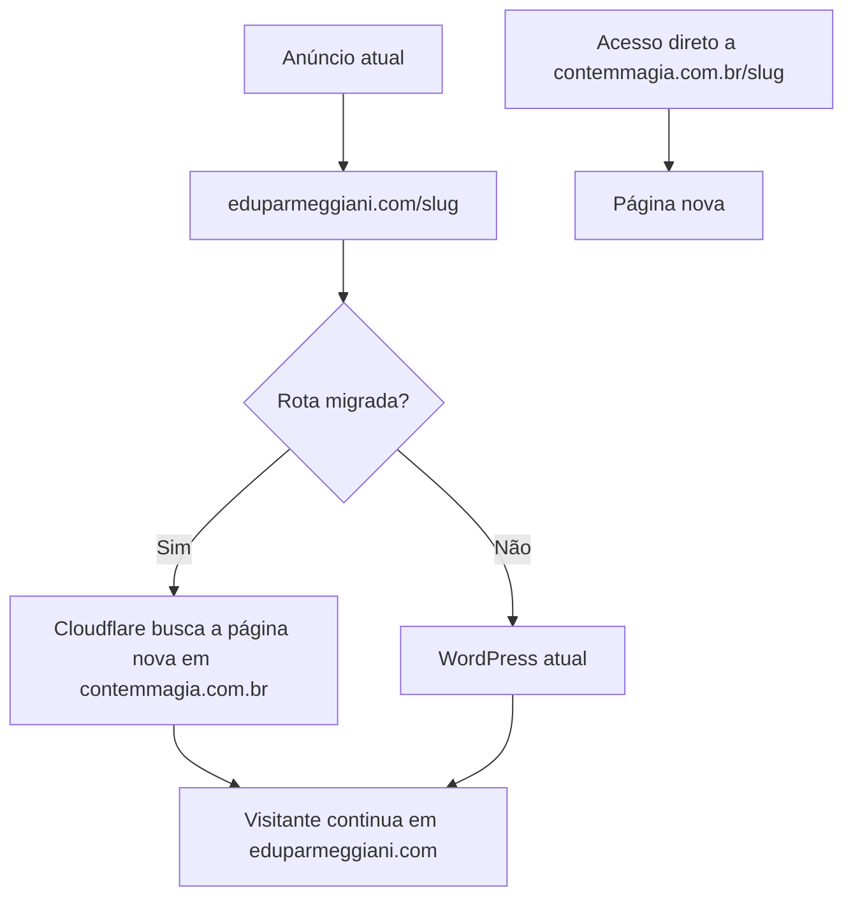

# Páginas novas nos endereços atuais das campanhas

> Estratégia substituída em 10/09/2026. O plano vigente é [PLANO-migracao-hospedagem-eduparmeggiani.md](PLANO-migracao-hospedagem-eduparmeggiani.md): receber o domínio inteiro na hospedagem nova e encaminhar as páginas antigas ao WordPress. Este documento permanece como histórico da investigação inicial, não como instrução de execução.

Data: 10/09/2026. Status: plano; nenhuma alteração em hospedagem, DNS, anúncios ou rastreamento realizada.

## Decisão recomendada

Manter `eduparmeggiani.com/slug` nos anúncios e na barra do navegador. A Cloudflare entrega, somente nas rotas migradas, o conteúdo publicado em `contemmagia.com.br/slug`. As demais rotas continuam chegando ao WordPress existente. As páginas novas também continuam disponíveis diretamente em `contemmagia.com.br`.

Isso se chama **proxy reverso**: o servidor busca a página nova e a entrega no endereço que o visitante já abriu. Não é redirecionamento do navegador nem uma página dentro de iframe.

O usuário confirmou que as campanhas são da Meta (Facebook e Instagram) e que o visitante pode continuar vendo o domínio antigo. O pedido atual autoriza investigação e plano, não implantação.

## Sobre “resetar toda a inteligência” da campanha

A afirmação é mais ampla do que a documentação permite concluir. A Meta informa que alterações significativas, como mudanças no criativo, público ou evento de otimização, fazem o **conjunto de anúncios** voltar à fase de aprendizado. Isso pode causar instabilidade e aumento do custo por resultado; não equivale a apagar todo o histórico da conta ou do pixel. O artigo consultado não estabelece uma regra específica de que qualquer troca de URL apaga todo aprendizado. [Meta: edições significativas e fase de aprendizado](https://www.facebook.com/business/help/316478108955072?locale=en_US).

A solução proposta evita editar os anúncios. Entretanto, mudar a página pode mudar sua taxa de conversão e, portanto, os sinais recebidos pela Meta. Não é possível prometer desempenho idêntico nem ausência de novas verificações da plataforma. A oferta precisa continuar coerente com o anúncio e a medição precisa funcionar até a compra.

## O que foi conferido

O repositório possui oito pastas de páginas. Consultas HTTP públicas, sem login e sem executar JavaScript, produziram este resultado:

| Slug | eduparmeggiani.com | contemmagia.com.br |
|---|---|---|
| `bce` | 200, página WordPress | 403 |
| `drb` | 200, página WordPress | 403 |
| `mce` | 200, página WordPress | 403 |
| `mpg` | 200, página WordPress | 403 |
| `gdp` | 200, página WordPress | 403 |
| `coe` | 404 | 200 |
| `ecm-26` | 404 | 200 |
| `ecm-26-v1` | 404 | 403 |

Os 200 acima podem ocorrer após normalização para a URL com barra final. Os seis 403 também foram reproduzidos consultando diretamente a URL com barra. São evidências dessas consultas, não prova de bloqueio para todos os visitantes. Conferir arquivos publicados, diretório de destino, permissões, regras do servidor e segurança/cache antes de ativar qualquer rota. Não encaminhar tráfego pago para esses destinos enquanto a causa estiver aberta.

Os 404 no domínio antigo reforçam a necessidade de obter as URLs reais dos anúncios: o nome da pasta não prova qual é a slug usada em campanha. Incluir as oito páginas no mapa final, preservando também eventuais endereços antigos diferentes dos nomes das pastas.

Ambos os domínios têm nameservers da Cloudflare, mas pares diferentes. Isso não comprova que estejam na mesma conta nem que as permissões disponíveis atendam aos dois. `www.eduparmeggiani.com` aponta publicamente para `crhishmxlb.wpdns.site`; conferir separadamente o domínio com e sem `www`. A raiz do domínio antigo e o endereço técnico do WordPress responderam 200.

Há configuração local de FTP e Cloudflare no `.env`; seus valores não foram exibidos e sua validade/permissões não foram testadas. O publicador atual limpa cache apenas de URLs de `contemmagia.com.br`.

Foi encontrado `GTM-P629X98` em sete páginas. Na fonte de `ecm-26`, a busca não encontrou GTM nem o mesmo mecanismo de repasse de parâmetros encontrado nas outras. Isso exige conferência da versão publicada e do comportamento no navegador; a busca textual não comprova presença ou ausência de eventos, pois eles podem vir de scripts externos, do build ou do GTM. Não alterar rastreadores com base apenas nessa busca.

## Arquitetura e limites

Usar um Cloudflare Worker com rotas no domínio antigo, condicionado à confirmação da zona ativa, DNS com proxy habilitado, origem atual e compatibilidade com a hospedagem WordPress. A documentação prevê esse uso à frente de um servidor existente. [Cloudflare: rotas](https://developers.cloudflare.com/workers/configuration/routing/routes/).

Manter o destino DNS atual do WordPress. **DNS não escolhe servidor por slug**: essa escolha será feita pela regra de aplicação. Não apontar todo o domínio para a hospedagem nova.

O mapa deve conter caminho de entrada, página nova correspondente, arquivos associados, variante com/sem barra e retorno ao estado anterior. Preferir rotas restritas e uma lista explícita de caminhos aceitos. Uma regra `/bce*` isolada não pode capturar acidentalmente `/bce-outro-produto`; validar o limite de caminho dentro do Worker. Incluir parâmetros na correspondência de rotas sem usá-los para decidir qual versão da oferta o visitante recebe.

Para as rotas selecionadas, buscar o destino HTTPS correto e devolver o conteúdo preservando a URL pública. Resolver a barra final internamente quando possível; não repassar ao navegador um `Location` que o leve ao domínio novo. Evitar ciclos entre os dois domínios. Preservar parâmetros, inclusive repetidos e codificados, sem sobrescrever oferta, cupom ou identificadores já existentes no checkout.

Imagens, fontes, CSS e scripts precisam resolver no lugar certo. Conferir caminhos relativos, caminhos iniciados por `/`, links absolutos, políticas de segurança, CORS e cookies. Não encaminhar cookies de sessão do WordPress para a hospedagem estática sem necessidade. Não reescrever cookies indiscriminadamente.

Rotas de administração, login, API, formulários, uploads, feeds e páginas não migradas devem continuar na origem atual. Requisições de formulário e outros métodos precisam ser mapeados; não converter POST em simples leitura de HTML. O proxy deve entregar o mesmo conteúdo para visitantes e revisores da Meta.

Definir uma URL canônica por página para os buscadores. Proposta: `contemmagia.com.br/slug/`, coerente com várias fontes atuais, sem redirecionar campanhas. A indicação canônica ajuda a tratar duplicidade, mas não garante transferência de posicionamento; conferir páginas com tráfego orgânico antes de consolidar essa escolha.

### Performance e cache

O proxy elimina a navegação adicional de um redirecionamento entre domínios, mas acrescenta processamento e uma busca ao servidor quando não há cache. O ganho precisa ser medido, não presumido.

Começar com cache conservador e medir TTFB e LCP no celular, incluindo primeira visita e cache aquecido. Só compartilhar HTML entre URLs com parâmetros quando estiver comprovado que esses parâmetros não mudam o conteúdo. Nunca armazenar respostas personalizadas, de formulário, com cookies de sessão ou erros como se fossem uma página pública válida. Não registrar identificadores de clique completos nos logs.

Adaptar o processo canônico `./publicar.sh [slug ...]` para invalidar também a versão servida no domínio antigo quando ela tiver cache próprio. A invalidação precisa alcançar a chave realmente usada pelo Worker. Não criar uma segunda cópia das páginas para manter manualmente.

## Plano de execução

### 1. Fechar o mapa e recuperar a saúde dos destinos

Obter URLs reais dos anúncios ativos, parâmetros e evento de otimização; cruzar com as oito páginas. Confirmar DNS/origem, resolver os 403 e registrar a linha de base de carregamento e eventos. Salvar configurações atuais e a relação de rotas que devem permanecer no WordPress.

**Tem que fazer:** oito páginas mapeadas, destinos 200 e correspondência entre produto, anúncio e checkout comprovada.

**Não pode acontecer:** tratar uma slug inferida como URL confirmada de campanha, alterar anúncios ou encaminhar tráfego para uma página com erro.

### 2. Preparar o proxy em ambiente de teste

Implementar o mapa explícito e testar páginas, arquivos, parâmetros, barras, `www`, métodos e falhas sem ativar as rotas de produção. O teste deve reproduzir condições do domínio final; uma prévia em outro domínio não valida sozinha cookies e gatilhos por hostname.

**Tem que fazer:** endereço público preservado e retorno à origem original ensaiado.

**Não pode acontecer:** domínio inteiro migrado, loop, captura de slugs vizinhas ou interferência no WordPress.

### 3. Validar rastreamento de ponta a ponta

Comparar WordPress e página nova usando a mesma configuração de consentimento e o navegador interno de Facebook/Instagram, além de Safari e Chrome móvel. Conferir Pixel/dataset existente, eventos configurados, regras do GTM por domínio, conversões personalizadas por URL e eventual API de Conversões (CAPI).

Testar `fbclid` e UTMs desde a entrada até o checkout em `pay.contemmagia.com.br`, sem assumir que copiar parâmetros resolve continuidade de identificação. Conferir `_fbp`/`_fbc` quando aplicáveis, origem do evento, valor/moeda/produto e deduplicação entre Pixel e CAPI por `event_id`. Cookies de um domínio não são automaticamente compartilhados com outro. Conferir o carregamento adiado de tags para não perder visitas curtas ou eventos antes da saída.

Validar PageView, ViewContent, InitiateCheckout e Purchase conforme o desenho real existente; não inventar eventos extras nem disparar compra no clique de botão. Compra deve ser verificada em modo de teste do provedor, sem cobrança real. Conferir Analytics entre domínios se utilizado. Parâmetros podem ser perdidos em redirecionamentos e precisam ser preservados no fluxo completo. [Google Analytics: perda de identificadores em redirecionamentos](https://support.google.com/analytics/answer/15629968?hl=en) e [medição entre domínios](https://support.google.com/analytics/answer/10071811?hl=en-GB).

**Tem que fazer:** evidência no Gerenciador de Eventos e no checkout de que os eventos esperados chegam uma vez, com seus dados corretos.

**Não pode acontecer:** novo pixel no lugar do atual, compra duplicada, quebra de parâmetros de oferta ou uma melhora de velocidade obtida por retirar medição necessária.

### 4. Ativar uma página piloto e observar

Após autorização de implantação, escolher uma página com URL ativa confirmada, destino saudável e menor exposição financeira. Ativar somente essa rota; repetir a validação no domínio real. Registrar horário e versão. Observar erros e eventos imediatamente, revisar em 24 horas e acompanhar por 48–72 horas antes de ampliar, usando volume suficiente para interpretar os resultados.

**Tem que fazer:** limites de performance e sinais de alerta definidos a partir da linha de base antes da ativação; monitoramento de página, checkout e eventos reais agregados.

**Não pode acontecer:** alterar orçamento, criativo, URL ou evento de otimização para viabilizar a migração; declarar sucesso de atribuição só porque a página abre. Uma janela de 72 horas não prova estabilidade estatística de CPA/ROAS.

### 5. Expandir e manter retorno rápido

Liberar as demais rotas em lotes pequenos após o aceite anterior, cobrindo as oito páginas e seus aliases confirmados. Repetir os testes afetados por cada lote. Manter o WordPress e as páginas antigas durante a estabilização.

**Tem que fazer:** registro final das rotas, provas de funcionamento e procedimento de publicação/cache atualizado.

**Não pode acontecer:** apagar o WordPress ou deixar páginas não migradas dependentes da hospedagem nova.

## Retorno ao estado anterior

Desabilitar a rota afetada ou removê-la do mapa e invalidar o cache correspondente. A requisição volta à origem WordPress sem trocar DNS nem editar anúncio. Ensaiar antes: a propagação de regras/cache não deve ser tratada como instantânea.

Acionar retorno por erro de página ou checkout, conteúdo incorreto, parâmetros perdidos, eventos ausentes/duplicados ou regressão relevante contra os limites definidos. Não usar oscilação isolada de CPA como prova de falha técnica.

Onde a URL antiga hoje é 404, retornar ao estado anterior também devolve 404. Essas rotas precisam de versão estática anterior saudável ou outra recuperação testada; não prometer WordPress como fallback onde não existe página equivalente. Evitar fallback automático genérico que possa servir produto errado ou esconder falhas.

## Acessos necessários

| Acesso | Para quê | Nível necessário |
|---|---|---|
| Cloudflare de `eduparmeggiani.com` | Conferir origem, proxy, DNS, redirects e regras; instalar Worker e rotas | Leitura inicialmente; na execução, edição de Workers e rotas, cache e ajustes estritamente necessários da zona |
| Cloudflare de `contemmagia.com.br` | Investigar 403, conferir segurança/cache e comunicação com o proxy | Leitura inicialmente; edição das regras/cache afetados na execução |
| Hospedagem de `contemmagia.com.br` | Conferir diretórios, arquivos, permissões e logs; corrigir publicação se necessário | Painel ou acesso técnico restrito ao site; o FTP já configurado pode cobrir arquivos, mas não necessariamente logs/regras |
| Painel da hospedagem WordPress | Confirmar origem, SSL e compatibilidade com Cloudflare; localizar bloqueios e preparar recuperação | Consulta e backup; alterações somente se necessárias ao plano |
| WordPress | Inventariar slugs, redirecionamentos, plugins de rastreamento/CAPI, formulários e páginas antigas | Consulta/exportação inicialmente; acesso administrativo temporário se o painel exigir para essas configurações |
| Meta Business: conta de anúncios e Gerenciador de Eventos | Ler URLs e eventos de otimização; conferir pixel/dataset, domínios, conversões personalizadas e eventos de teste | Visualização de campanhas; acesso ao dataset e diagnóstico. Gestão de integrações apenas se for necessário corrigir rastreamento |
| Google Tag Manager | Conferir gatilhos e tags do contêiner encontrado nas páginas | Leitura e prévia; edição/publicação apenas para correções identificadas |
| Checkout `pay.contemmagia.com.br` e integração CAPI, se existir | Testar pedido, parâmetros e Purchase, conferir deduplicação e integração com a Meta | Configurações técnicas e ambiente/modo de teste; não é necessário acesso a saques ou gestão financeira |
| GA4, se utilizado | Conferir continuidade de medição entre página e checkout | Leitura; edição somente se necessária à configuração entre domínios |

Não é necessário fornecer tudo de uma vez. **Para começar, priorizar Cloudflare do domínio antigo, painel da hospedagem nova e leitura da Meta/Events Manager.** Esses acessos permitem confirmar a viabilidade, investigar os 403 e obter as URLs reais. Os demais completam a validação antes da implantação.

O projeto já contém credenciais locais de FTP e Cloudflare: conferir seu alcance antes de pedir outras. Não assumir que um token de limpeza de cache autoriza Workers ou a outra zona. Usar sessão autenticada ou credenciais restritas no armazenamento local apropriado; não enviar senhas ou tokens no texto da conversa. Tokens de infraestrutura devem ficar limitados às contas/zonas e ações necessárias.

Não é necessário acesso ao registrador do domínio se a zona atual estiver sob controle e não houver mudança de nameservers. O plano não prevê essa mudança. O plano também não depende de permissão para editar campanhas.

## Comparação das alternativas

| Alternativa | Efeito para este caso |
|---|---|
| Proxy por slug na Cloudflare | Recomendada: conserva URL pública, campanhas e WordPress das demais rotas; exige validação de cache, arquivos e eventos |
| Redirecionamento 301/302 para o domínio novo | Troca o endereço visível e acrescenta navegação; parâmetros podem ser preservados, mas a mudança de domínio ainda exige validação de identificação. 301 dificulta retorno por cache persistente |
| Redirecionamento por JavaScript ou iframe | Acrescenta dependência de execução ou problemas de navegação/rastreamento; não atende melhor ao objetivo |
| Apontar o DNS inteiro para a hospedagem nova | Não separa páginas migradas e antigas; pode derrubar as não migradas |
| Instalar regras na hospedagem WordPress | Alternativa caso não haja controle da Cloudflare; depende do suporte da hospedagem e mantém o servidor antigo no caminho das páginas novas |

## Limites da investigação

Foram consultados código local, configuração de exemplo, nomes de chaves locais sem revelar valores, DNS público, respostas HTTP e documentação oficial. Não houve login em painéis, execução de compra, teste de eventos real nem medição de velocidade no navegador. Os acessos acima são necessários para fechar essas provas; o plano não declara implantação pronta.

Medição operacional desta tarefa: duração total e consumo de tokens não disponíveis de forma instrumentada. Não houve correção após declaração de pronto. Validação deste artefato: conferência do mapa de oito páginas, escopo autorizado, acessos, critérios de aceite e procedimento de retorno.

## Resumo em linguagem simples

**Vamos mostrar as páginas novas nos mesmos endereços que seus anúncios já usam.** Quem clicar em `eduparmeggiani.com/bce`, por exemplo, verá a página nova, mas continuará vendo esse endereço no navegador. Ela também continuará disponível em `contemmagia.com.br/bce`.

A Cloudflare fará essa escolha nos bastidores: página já migrada recebe a versão nova; página ainda não migrada continua no WordPress. Não será necessário trocar os links dos anúncios.

O trabalho será feito nesta ordem:

1. **Conferir os links e corrigir os erros atuais.** Identificar os endereços exatos usados nos anúncios e resolver os erros de acesso encontrados em seis páginas novas.
2. **Preparar a troca por página.** Configurar quais endereços mostram a versão nova, mantendo as outras páginas funcionando como hoje.
3. **Testar o caminho até a compra.** Conferir se a página abre rápido, se os botões levam ao produto certo e se a Meta continua recebendo as informações de visita e compra, sem perder ou contar vendas duas vezes.
4. **Começar por uma página.** Acompanhar o funcionamento antes de liberar as demais. Se houver problema, voltar à versão anterior já testada.
5. **Liberar as outras aos poucos.** Manter o WordPress disponível durante essa transição e garantir que futuras atualizações apareçam nos dois endereços.

**Sobre o aprendizado da Meta:** mudanças no anúncio podem fazê-lo voltar à fase de aprendizado, mas não há base para dizer que trocar um link apaga toda a inteligência da campanha. Com esta solução, não precisamos editar os anúncios. Ainda assim, precisamos acompanhar os resultados, porque uma página diferente pode vender mais ou menos, mesmo com o mesmo endereço.

**Para começar, preciso de acesso à Cloudflare do domínio antigo, ao painel da hospedagem nova e à visualização das campanhas e dos eventos na Meta.** Depois, para conferir o rastreamento completo, posso precisar também do WordPress, do Google Tag Manager, da Cloudflare do domínio novo e das configurações de rastreamento do checkout. Primeiro vou aproveitar os acessos que já existem no projeto. Não é necessário enviar senhas nesta conversa nem dar permissão para mexer em orçamento ou saques.

Até aqui, foi feita apenas a investigação e este plano. Nenhuma campanha ou configuração dos sites foi alterada.
